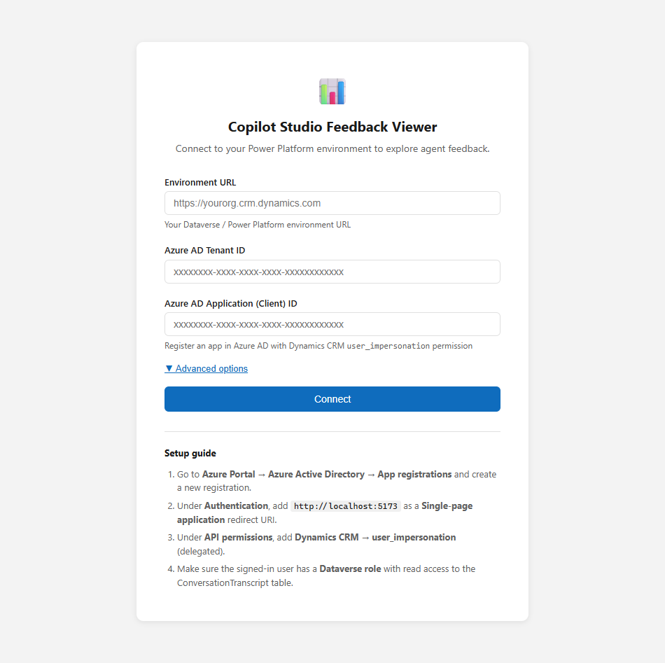
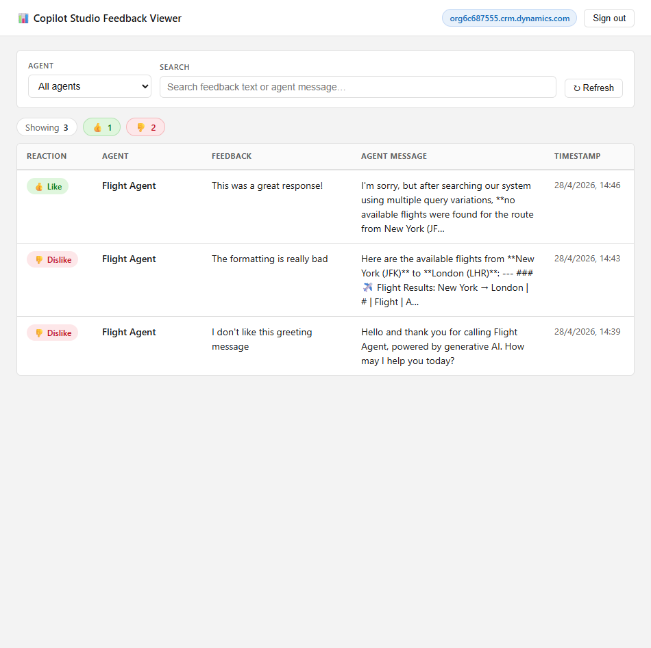
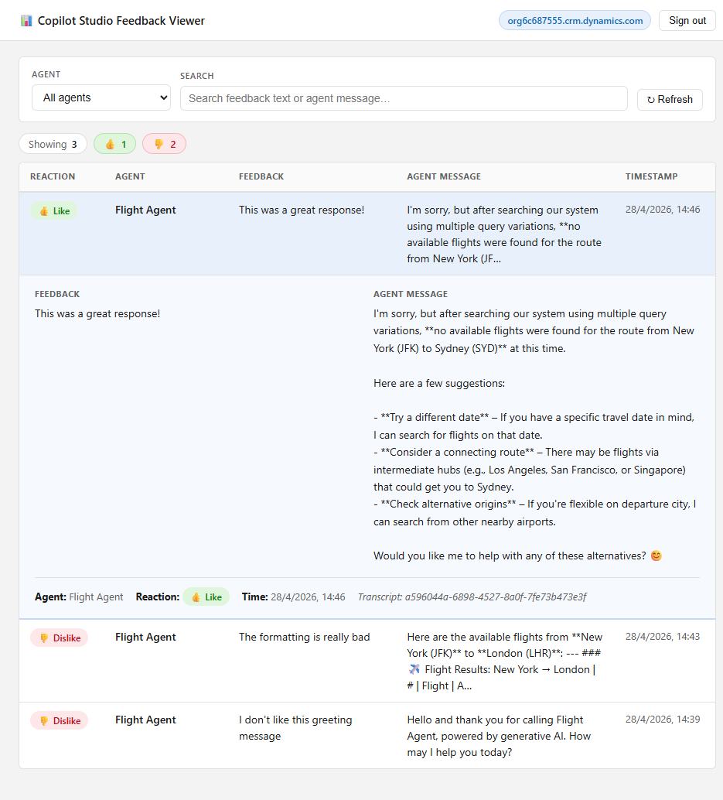

# Copilot Studio Feedback Viewer

A lightweight web app that lets you browse and search the feedback left by users on your [Microsoft Copilot Studio](https://www.microsoft.com/en-us/microsoft-copilot/microsoft-copilot-studio) agents. It reads directly from the **ConversationTranscript** table in Dataverse using the Dataverse Web API and Microsoft Entra ID (Azure AD) authentication.


## Features

- **View all feedback** — see thumbs-up / thumbs-down reactions and the free-text comments users left on agent responses.
- **Filter by agent** — use the dropdown to focus on a specific agent when your environment hosts multiple bots.
- **Search** — full-text search across feedback text and agent messages.
- **Expand details** — click any row to see the full agent message the feedback was given on, along with metadata like transcript ID.
- **Stats at a glance** — quick count of 👍 likes and 👎 dislikes for the current filter.
- **Zero backend** — runs entirely in the browser as a single-page application; no server required.
- **Auto-discovery** — automatically detects the correct Dataverse table schema (prefixed or unprefixed) and API version for your environment.

## Screenshots

| Configuration | Login | Dashboard |
|---|---|---|
|  |  |  |

**Expanded detail view** — click a row to see the full agent response and metadata:



## Prerequisites

- **Node.js** 18+ and **npm**
- A **Power Platform / Dataverse environment** with Copilot Studio agents that have conversation transcripts
- A **Microsoft Entra ID (Azure AD) app registration** with:
  - **Single-page application** redirect URI (e.g. `http://localhost:5173`)
  - **Dynamics CRM → `user_impersonation`** delegated API permission
- The signed-in user must have a **Dataverse security role** with read access to the `ConversationTranscript` table

## Getting started

### 1. Clone the repository

```bash
git clone https://github.com/<your-username>/copilotstudio-feedback.git
cd copilotstudio-feedback
```

### 2. Install dependencies

```bash
npm install
```

### 3. Configure (pick one)

**Option A — Environment variables** (set once at build time):

Copy `.env.example` to `.env` and fill in your values:

```env
VITE_DATAVERSE_URL=https://yourorg.crm.dynamics.com
VITE_AZURE_CLIENT_ID=xxxxxxxx-xxxx-xxxx-xxxx-xxxxxxxxxxxx
VITE_AZURE_TENANT_ID=xxxxxxxx-xxxx-xxxx-xxxx-xxxxxxxxxxxx
```

**Option B — In-app configuration** (no `.env` needed):

Simply start the app and you'll be presented with a configuration screen where you can enter the same values interactively. The settings are stored in `localStorage` so you only need to enter them once per browser.

### 4. Run

```bash
npm run dev
```

Open [http://localhost:5173](http://localhost:5173) and sign in with your Microsoft account.

## Building for production

```bash
npm run build
```

The output is written to the `dist/` folder. You can serve it with any static file server or deploy to Azure Static Web Apps, GitHub Pages, Vercel, etc.

> **Note:** When deploying, make sure the hosting URL is added as a redirect URI in your Azure AD app registration.

## Setting up the Azure AD app registration

1. Go to **Azure Portal → Microsoft Entra ID → App registrations** and create a new registration.
2. Under **Authentication**, add your app URL (e.g. `http://localhost:5173`) as a **Single-page application** redirect URI.
3. Under **API permissions**, add **Dynamics CRM → `user_impersonation`** (delegated).
4. Make sure the signed-in user has a **Dataverse security role** with read access to the **ConversationTranscript** table.

## How it works

1. The app authenticates via **MSAL.js** (Microsoft Authentication Library) using a popup flow.
2. It acquires a token scoped to your Dataverse environment (`https://yourorg.crm.dynamics.com/.default`).
3. It calls the **Dataverse Web API** to fetch all records from the `ConversationTranscript` table (paginating through `@odata.nextLink` if needed).
4. Each transcript's JSON `content` field is parsed to find **feedback activities** — activities of type `invoke` with `actionName === "feedback"`.
5. The feedback text, reaction (like/dislike), and the agent message it refers to (resolved via `replyToId`) are extracted and displayed in the table.

## Tech stack

- [React](https://react.dev/) 18
- [TypeScript](https://www.typescriptlang.org/)
- [Vite](https://vite.dev/)
- [MSAL React](https://github.com/AzureAD/microsoft-authentication-library-for-js/tree/dev/lib/msal-react) for Azure AD authentication
- [Dataverse Web API](https://learn.microsoft.com/en-us/power-apps/developer/data-platform/webapi/overview) for data access

## Project structure

```
├── index.html                  # Entry point
├── src/
│   ├── main.tsx                # React root
│   ├── App.tsx                 # App shell (config gate → MSAL → dashboard)
│   ├── App.css                 # Global styles
│   ├── authConfig.ts           # MSAL configuration & token helpers
│   ├── components/
│   │   ├── ConfigPage.tsx      # First-run configuration form
│   │   └── FeedbackTable.tsx   # Feedback table with expandable rows
│   ├── services/
│   │   ├── dataverse.ts        # Dataverse API client & schema detection
│   │   └── transcriptParser.ts # Transcript JSON → FeedbackItem[] extraction
│   └── types/
│       └── index.ts            # TypeScript interfaces
├── .env.example                # Environment variable template
├── vite.config.ts
├── tsconfig.json
└── package.json
```

## License

MIT
